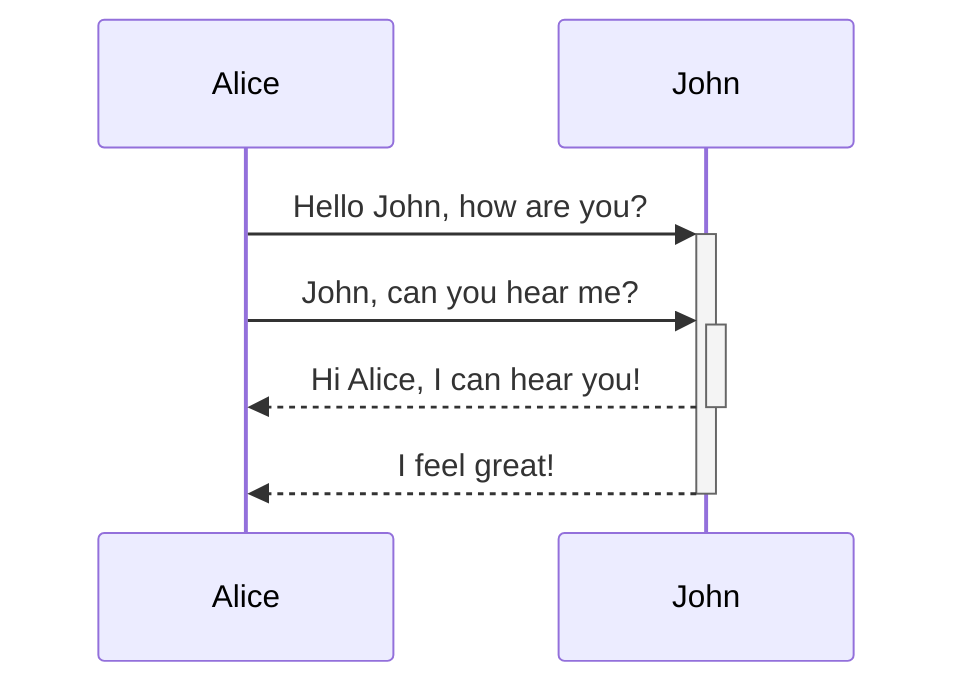
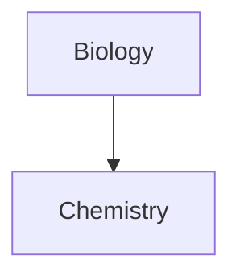

ctr + E => Editing mode
ctr + L = > Todo List
ctrl + ; => properties

DATE RANGE  date1..date2

USEFUL NAMING CONVENTIONS
_ followed by number for MOCS
; Articles
: 
$ tweeter
. youtube
, podcast
& books
~ movies
@ series

<sup> for supscript

<sub> for subscript
<sub>2</sub>

First two letters of a common topic
ex:    YT_  youtube
	GT_  guitar
	NV_ novel
	CR_ car
	MS_ music 
	MV_ movies
	SS_ series


|Style|Syntax|Example|Output|
|---|---|---|---|
|Bold|`** **` or `__ __`|`**Bold text**`|**Bold text**|
|Italic|`* *` or `_ _`|`*Italic text*`|_Italic text_|
|Strikethrough|`~~ ~~`|`~~Striked out text~~`|~~Striked out text~~|
|Highlight|`== ==`|`==Highlighted text==`|==Highlighted text==|
|Bold and nested italic|`** **` and `_ _`|`**Bold text and _nested italic_ text**`|**Bold text and _nested italic_ text**|
|Bold and italic|`*** ***` or `___ ___`|`***Bold and italic text***`|**_Bold and italic text_**|

## Internal links

Obsidian supports two formats for [internal links](https://help.obsidian.md/Linking+notes+and+files/Internal+links) between notes:

- Wikilink: `[[Three laws of motion]]`
- Markdown: `[Three laws of motion](Three%20laws%20of%20motion.md)`

## External links

If you want to link to an external URL, you can create an inline link by surrounding the link text in brackets (`[ ]`), and then the URL in parentheses (`( )`).

```md
[Obsidian Help](https://help.obsidian.md)
```

## Lists

You can create an unordered list by adding a `-`, `*`, or `+` before the text.

```md
- First list item
- Second list item
- Third list item
```

- First list item
- Second list item
- Third list item

To create an ordered list, start each line with a number followed by a `.` symbol.

```md
1. First list item
2. Second list item
3. Third list item
```

1. First list item
2. Second list item
3. Third list item

## Horizontal rule

You can use three or more stars `***`, hyphens `---`, or underscore `___` on its own line to add a horizontal bar. You can also separate symbols using spaces.

```md
***
****
* * *
---
----
- - -
___
____
_ _ _
```

## Footnotes

You can add footnotes[[1]](https://publish.obsidian.md/#fn-1-244f05946d7a0374) to your notes using the following syntax:

```md
This is a simple footnote[^1].

[^1]: This is the referenced text.
[^2]: Add 2 spaces at the start of each new line.
  This lets you write footnotes that span multiple lines.
[^note]: Named footnotes still appear as numbers, but can make it easier to identify and link references.
```

You can also inline footnotes in a sentence. Note that the caret goes outside the brackets.

```md
You can also use inline footnotes. ^[This is an inline footnote.]
```

Note

Inline footnotes only work in reading view, not in Live Preview.

## Comments

You can add comments by wrapping text with `%%`. Comments are only visible in Editing view.

```md
This is an %%inline%% comment.

%%
This is a block comment.

Block comments can span multiple lines.
%%
```

## Tables

You can create table using vertical bars (`|`) and hyphens (`-`). Vertical bars separate columns, and hyphens define the column header.

```md
| First name | Last name |
| ---------- | --------- |
| Max        | Planck    |
| Marie      | Curie     |
```

## Diagram

You can add diagrams and charts to your notes, using [Mermaid](https://mermaid-js.github.io/). Mermaid supports a range of diagrams, such as [flow charts](https://mermaid.js.org/syntax/flowchart.html), [sequence diagrams](https://mermaid.js.org/syntax/sequenceDiagram.html), and [timelines](https://mermaid.js.org/syntax/timeline.html).

Tip

You can also try Mermaid's [Live Editor](https://mermaid-js.github.io/mermaid-live-editor) to help you build diagrams before you include them in your notes.

To add a Mermaid diagram, create a `mermaid` [code block](https://help.obsidian.md/Editing+and+formatting/Basic+formatting+syntax#Code%20blocks).

````md

````

JohnAliceJohnAliceHello John, how are you?John, can you hear me?Hi Alice, I can hear you!I feel great!

````md

````

### Linking files in a diagram

You can create [internal links](https://help.obsidian.md/Linking+notes+and+files/Internal+links) in your diagrams by attaching the `internal-link` [class](https://mermaid.js.org/syntax/flowchart.html#classes) to your nodes.

````md

````

## Math

You can add math expressions to your notes using [MathJax](http://docs.mathjax.org/en/latest/basic/mathjax.html) and the LaTeX notation.

To add a MathJax expression to your note, surround it with double dollar signs (`$$`).

```md
$$
\begin{vmatrix}a & b\\
c & d
\end{vmatrix}=ad-bc
$$
```

You can also inline math expressions by wrapping it in `$` symbols.

```md
This is an inline math expression $e^{2i\pi} = 1$.
```

This is an inline math expression .