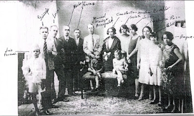
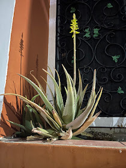

[[3112]] << [[JAN]] >>  [[0201]]

# 2026-:

# 2025-MRD:
## 1st Light
### Estoy agradecida por: 
* Poder compartir el día con mi mamá y mi papá
* Poder descansar y aprovechar de trabajar en mi plan para el nuevo año
### Hoy será un gran día por:
- Voy a reiniciar el Vault de Obsidian para implementar el Diario Perpetuo, de hecho esta es la primera entrada
## Last Light
### ¿Qué fue lo mejor (o menos peor) del día?:
Pude iniciar el nuevo Vault, consegui un nuevo uso para el mismo, ahora si será mi segundo cerebro, una memoria mucho mejor que la mia. 
### ¿Que faltó para que fuera incluso mejor?:
Haber podido descansar más, pero si logré descansar un ratico 
 
### Soundtrack del día:
-La margarita dijo no de Alejandro Sanz
### ¿Algo más que recordar?
- Hoy en la tarde aproveche de ir a visitar a las tías Mendoza, de casualidad me consegui a Nancy, Joan y Luis Antonio. Me quede hablando con mi Tia Elena, mi tia Chachi y mi Tia Olga, todas bien y felices de verme. Tenían una foto que me imagino sería Nancy la que traería. Es una foto de los tíos, abuelos de mi papá.
 

- Hoy también fui para Santa Ana y la plantita de sábila está hermosa, floreció y su hijito ha crecido bastante. Dicen que la espiga es de buen augurio 
 

